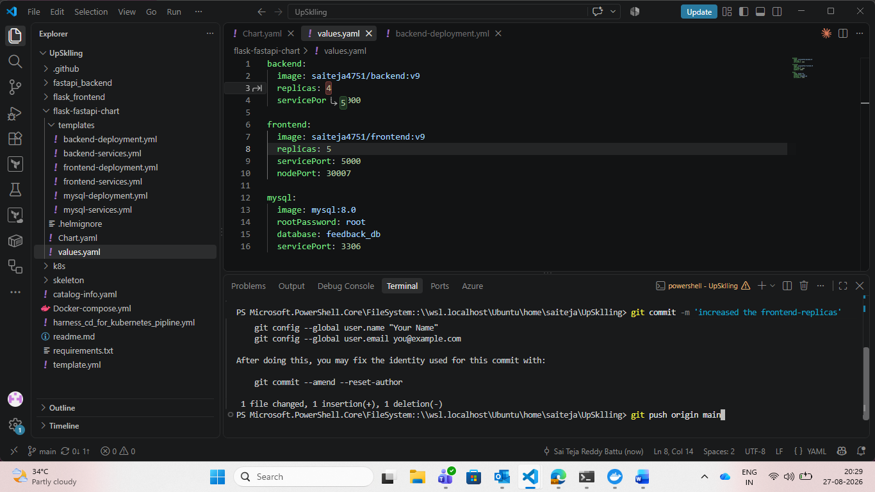

for fast-api :
  python -m uvicorn main:app --reload
for flask-application:
    python app.py

if you want to run the applicatoin through the docker.
   you need to update the host as mysql_db in fastapi_backend/main.py file
      host=os.getenv("DB_HOST", "mysql-db"),

how to run the application through check these commands:
      1)docker-compose up -> in docker-compose file
      2)docker exec -it mysql-container mysql -u root -p   -> the password is root-> for check the sql is working or not in the default-image name mysql

if you wanted to run the application through normally like it as local host.
  you need to update the host as localhost in fastapi_bakend/main.py file
      host=os.getenv("DB_HOST", "localhost"),

kuberberbetes setup:
 1.you should start the minikube cluster 
 2.the run the kubernetes deploymenets of frontend,backend and mysql also
 check the pods deployment,
 kubectl get all
 -kubectl apply -f k8s/backend
 -kubectl apply -f k8s/frontend
 -kubectl apply -f k8s/mysql

 imp: you should change the type as node port
 kubectl edit svc backend-service
 

ArgoCD & Helm Charts
GitOps Deployment Documentation – Full-Stack App (Flask + FastAPI + MySQL)
Prepared by: Sai Teja Reddy Battu  |  DevOps Trainee, Atyeti IT Services
Last updated: August 27, 2026
1. Overview
This document explains the end-to-end GitOps deployment workflow used for our full-stack application (React/Flask frontend, FastAPI backend, and MySQL database) using Helm charts for Kubernetes packaging and ArgoCD for continuous deployment. It is intended as a reference for the team to understand, reproduce, and troubleshoot the deployment process.
At a high level, any change pushed to the Git repository is automatically detected by ArgoCD and synced to the Kubernetes cluster — this is the core idea of GitOps: Git is the single source of truth for what should be running in the cluster.
Tools Used
•	Helm – packages the Kubernetes manifests (Deployments, Services) as reusable charts with configurable values.
•	GitHub Actions – CI pipeline that builds Docker images for backend and frontend and pushes them to Docker Hub.
•	ArgoCD – GitOps continuous delivery tool that watches the Git repo and auto-syncs the cluster state.
•	Kubernetes (Minikube / cluster) – runs the Deployments, Services, and Pods.
•	MySQL – backing database for application data (e.g. feedback records).
Workflow at a Glance
•	Developer updates Helm chart values (e.g. image tag, replica count) and pushes to Git.
•	GitHub Actions builds new Docker images and pushes them to Docker Hub.
•	ArgoCD detects the Git change and auto-syncs the Kubernetes cluster to match.
•	Kubernetes rolls out the updated Pods; we verify them with kubectl.
•	The application is validated end-to-end through the UI and the database.
 
2. Prerequisites
•	Access to the Git repository containing the Helm chart (flask-fastapi-chart).
•	kubectl configured against the target cluster, with the correct namespace (e.g. new-ns).
•	Docker Hub credentials configured as GitHub Actions secrets (for image push).
•	ArgoCD installed on the cluster with the application registered (e.g. fullstack-app).
•	Git identity configured locally: git config --global user.name / user.email.
3. Step-by-Step Deployment Process
1	Update Helm Chart Values
Open the Helm chart in VS Code (flask-fastapi-chart/values.yaml) and update the required values — for example, increasing the frontend replicas from 4 to 5, or changing an image tag. Keep changes scoped to values.yaml wherever possible so the chart templates stay reusable.

 
Editing values.yaml in VS Code — increasing frontend replicas, then committing and pushing the change.
Commit and push the change to the main branch:
•	git add .
•	git commit -m "increased the frontend replicas"
•	git push origin main
2	CI Pipeline – Build & Push Docker Images
Pushing to Git triggers the GitHub Actions workflow (build-and-push). The pipeline checks out the code, logs in to Docker Hub, then builds and pushes the backend and frontend images in sequence.
 
GitHub Actions run: Checkout → Docker Hub login → Build & Push backend/frontend images.
Wait for all jobs to complete successfully before moving to the next step. If a job fails, check the workflow logs for the failing step (commonly Docker Hub authentication or a Dockerfile build error).
3	ArgoCD Auto-Sync – GitOps Deployment
ArgoCD continuously watches the Git repository. Once it detects the new commit, it automatically syncs the cluster (Auto Sync is enabled) so the live state matches the desired state defined in Git. The Application Details view shows the sync status, health, and a live resource tree of every Deployment, Service, ReplicaSet, and Pod.
 
ArgoCD ‘fullstack-app’ – Healthy and Synced, with the full resource tree for frontend, backend, and MySQL.
Note: If the app shows ‘OutOfSync’, either wait for the auto-sync interval or trigger it manually with the SYNC button in the ArgoCD UI.
4	Verify Pods on the Cluster
Confirm the rollout directly on the cluster using kubectl. All backend, frontend, and MySQL pods should show STATUS Running and READY 1/1.
 
kubectl get pods -n new-ns — backend, frontend, and MySQL pods all Running.
•	kubectl get pods -n new-ns
 
5	Access the Application UI
With the pods running and the frontend Service exposed, open the application in a browser to confirm it is reachable and functioning — in this case, the Feedback Portal.
 
Feedback Portal UI served from the frontend Pod, confirming the deployment is reachable.
6	Submit & Verify Feedback (End-to-End Check)
Submit a test entry through the UI, then confirm it appears on the ‘Submitted Feedback’ page. This validates the full request path: frontend → backend (FastAPI) → MySQL → back to the UI.
 
Submitted feedback entry displayed on the view-feedback page — confirms frontend-to-backend connectivity.
7	Verify Data Persistence in MySQL
As a final check, connect directly to the MySQL pod and query the database to confirm the submitted data was actually persisted, not just displayed by the UI.
 
kubectl exec into the MySQL pod — querying feedback_db.feedback confirms the record was persisted.
•	kubectl exec -it <mysql-pod-name> -n new-ns -- mysql -u root -p
•	show databases;
•	use feedback_db;
•	select * from feedback;
 
4. Verification Checklist
•	Helm values updated and pushed to Git.
•	GitHub Actions build-and-push workflow completed successfully.
•	ArgoCD Application shows Healthy and Synced.
•	kubectl get pods shows all pods Running with expected replica counts.
•	Application UI loads and is reachable.
•	A test submission flows through the UI and is visible on the feedback page.
•	Data is confirmed present in the MySQL database via kubectl exec.
5. Troubleshooting Notes
•	App stuck OutOfSync in ArgoCD: check the Git commit reached the correct branch/path ArgoCD is watching, or click SYNC manually.
•	Pod stuck in CrashLoopBackOff: run kubectl logs <pod-name> -n new-ns to check application errors.
•	Image not updating: confirm the new image tag was actually pushed to Docker Hub and referenced in values.yaml.
•	Cannot connect to MySQL: verify the mysql Service name/port used by the backend matches mysql-services.yaml.
6. Conclusion
This GitOps workflow keeps Git as the single source of truth: every change to the application — replica counts, image versions, or configuration — goes through a commit, gets built by CI, and is automatically rolled out by ArgoCD. This gives us a fully auditable, repeatable deployment process with no manual kubectl apply steps required in normal operation.
